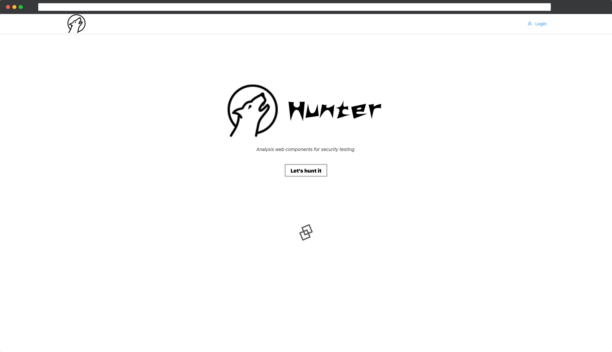
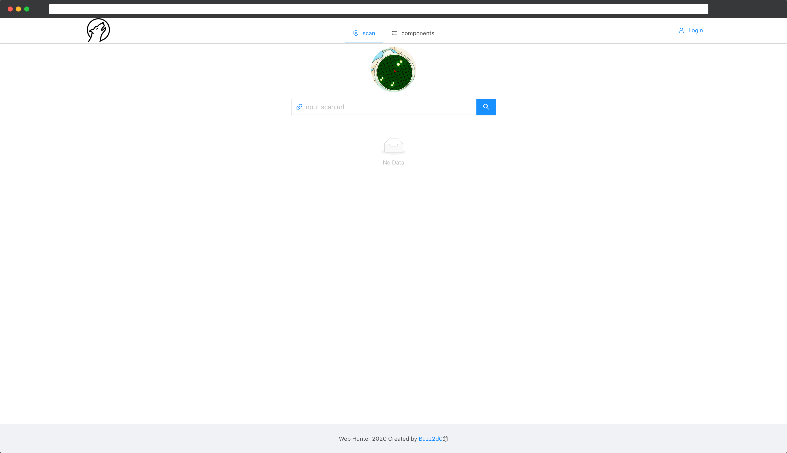
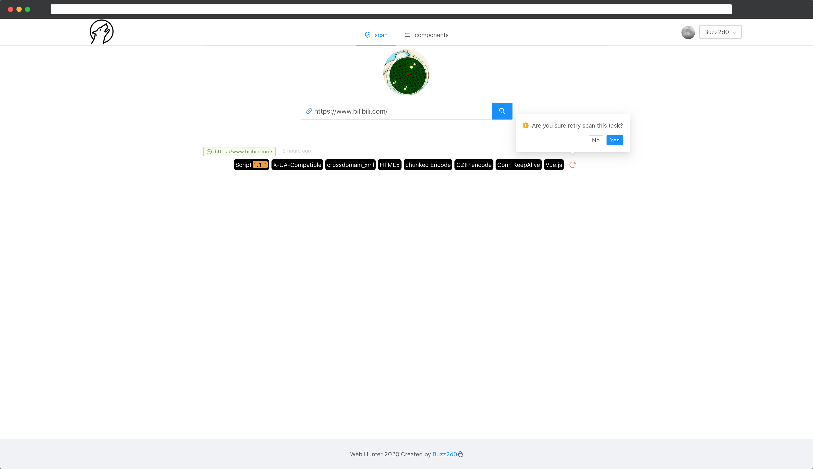
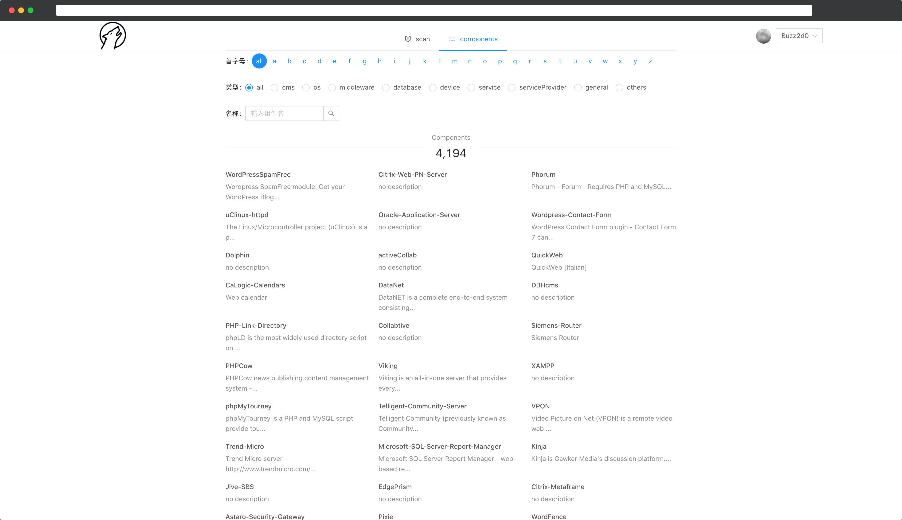

项目技术栈

- node `10.15.2`
- react `16.13.1`
- react-router-dom
- mobx && mobx-react
- antd && @ant-design/icons
- axios
- react-cookies
- react-infinite-scroller

# 页面

## Index

## Scan

- scan 功能只有登录用户才能使用（github）

- 会缓存扫描的结果，并且可以重新扫描

## Components

- 首字母、类型、名称过滤
- 滚动加载数据

